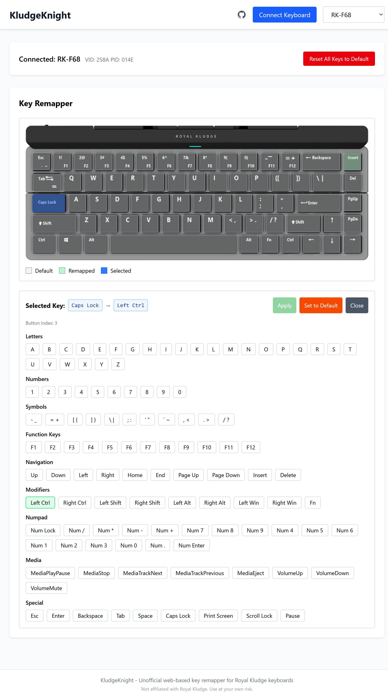

# KludgeKnight

**Unofficial web-based key remapper for Royal Kludge keyboards**

Remap any key on your Royal Kludge keyboard directly in your browser. No installation required.

🌐 **[Try it now at kludgeknight.com](https://www.kludgeknight.com/)**

> ⚠️ **Disclaimer**: This is unofficial software and is not affiliated with, endorsed by, or connected to Royal Kludge in any way. Use at your own risk.

> **Note**: This software has only been tested on the Royal Kludge F68 keyboard. While the key mappings are sourced from the official RK software and should work with other RK keyboards, functionality on other models has not been verified.

## ✨ Features

- 🌐 **Runs in your browser** - No downloads or installation
- 🎹 **Visual keyboard layout** - See your keyboard and click to remap
- 🔄 **Live updates** - Changes apply immediately to your hardware
- 🔒 **Privacy first** - Everything happens locally, no data sent anywhere
- 🗺️ **Key mappings from official RK software** - Keyboard layouts and configurations pulled from the official Royal Kludge app

### ⚠️ Important Limitation

**The app cannot read your existing key mappings from the keyboard.** Due to firmware limitations, we can only write new mappings, not read what's currently set.

This means:
- If you've already remapped keys using RK software, those mappings won't be visible here
- The app always starts with the default keyboard layout
- Any remapping you do will overwrite what's currently on the keyboard

## 📸 Screenshot



## 🚀 Getting Started

### Requirements

- **Browser**: Chrome, Edge, or Opera (WebHID support required)
- **Keyboard**: Royal Kludge keyboard with USB cable

### How to Use

1. **Visit the app** at [kludgeknight.com](https://www.kludgeknight.com/)
2. **Click "Connect Keyboard"** and select your keyboard from the list
3. **Click any key** on the keyboard diagram
4. **Select a new key** to remap it to
5. **Done!** The change is saved to your keyboard immediately

### Resetting Keys

- **Single key**: Click any key and select "Set to Default" to reset it to its original function
- **All keys**: Click "Reset All Keys to Default" button

## ❓ FAQ

### Which browsers work?

- ✅ **Chrome** (version 89+)
- ✅ **Edge** (version 89+)
- ✅ **Opera** (version 75+)
- ❌ **Firefox** - Not supported (no WebHID)
- ❌ **Safari** - Not supported (no WebHID)

### Which keyboards are supported?

Any Royal Kludge keyboard that works with the official RK software should be supported. The keyboard configurations are [pulled directly from the official RK Windows app](https://github.com/vinc3m1/rk-web/tree/main/public/rk/Dev), so if your keyboard works with the official software, it should work here too.

<details>
<summary>View full list of supported keyboards</summary>

- RK-G68 Keyboard
- RK-61 Keyboard
- RK100RGB Keyboard
- RK84RGB Keyboard
- RK857 Keyboard
- RK68RGB Bluetooth Dual Mode
- RK71RGB Keyboard
- RK68Plus Keyboard
- RK71RGB Wireless
- RK61RGB Wired Keyboard
- RK100RGB Wireless Keyboard
- RK71RGB Wired Keyboard
- RK87RGB Keyboard
- RK987RGB
- RK987RGB Wired Keyboard
- RK61RGB ISO Return Keyboard
- RK-G68RGB-UK Keyboard
- RK68RGB Wired Keyboard
- G68RGB ISO Return Keyboard
- RK61 RGB Bluetooth Dual Mode
- RK100PRO Keyboard
- RK98 RGB Keyboard
- 68RGB Wired Keyboard
- G87RGB Wired Keyboard
- RK87T RGBWired Keyboard
- G87RGB Wired Keyboard
- RK96 RGB Keyboard
- RK87 Keyboard
- RK61RGB ISO ReturnWired
- RK68Pro Keyboard
- RK68ISO Return Keyboard
- RK750-100RGB Keyboard
- RK896 Keyboard
- RK98-100KRGB N Keyboard
- K87RGB N Keyboard
- RK87RGB N Wired Keyboard
- RK920RGB Keyboard
- RK858  61   Keyboard
- RK98Wired-100KRGB Keyboard
- RK98Wired-100K N RGB Keyboard
- RK61RGB N Keyboard
- RK84N RGB Keyboard
- RK100RGB N Keyboard
- RK61RGB N ISO Return Keyboard
- RK71RGB N Wired Keyboard
- RK883RGB N Wired Keyboard
- RK71RGB N BT Keyboard
- G68 Keyboard
- RK61 Keyboard
- RK100 Keyboard
- RK857 Single
- RK68 Bluetooth Dual Mode
- RK71 Keyboard
- RK71 Bluetooth Dual Mode
- RK-68Plus
- RK987 Single Color
- RK96 Keyboard
- RK SINK104 Keyboard
- RK61 Bluetooth Dual Mode
- RK960 Keyboard
- RK61ISO Return Keyboard
- RK87(882) Keyboard
- RK87(882) Wired Keyboard
- RK932 Keyboard
- RK68 a switch Keyboard
- RK89 Keyboard
- RK857 Single
- RK92RGB N Keyboard
- RK89RGB Keyboard
- RK84Pro N RGB Keyboard
- RK61 N RGB Bluetooth Dual Mode
- RK Round RGB Keyboard
- RK-H87RGB Keyboard
- RK84 RGB ISO Return Keyboard
- RK61plus RGB Keyboard
- RK61 N RGB Bluetooth Dual Mode
- RK-R87RGB Wired Keyboard
- RK-R87 Wired Keyboard
- RK987RGB N  Keyboard
- RKG68RGB N Keyboard
- RK68plus RGB N Keyboard
- RK68RGB N Bluetooth Dual Mode
- RK68 N ISO Return Keyboard Bluetooth
- RK71RGB N Keyboard
- RK-H81RGB
- RK84RGB N Wired Keyboard
- RK68RGB N Wired Keyboard
- RK987RGB 2.4G N Keyboard
- RK937RGB Wired Keyboaed
- RK-R104 Single
- RK-R104 RGB
- R87RGB
- RK104 RGB Wired
- RK61RGB N Wired Keyboard
- RK87RGB ISO Return Keyboard
- RK932RGB Keyboard
- RK-R87S
- RK-S87 RGB Wired Keyboard
- RK-S87 RGB Keyboard
- RKG68 RGB N Wired Keyboard
- RK-H81RGB-N
- RK-M75
- R98-RGB2.0
- RK868RGB Wired keyboard
- RK932RGB
- RK-G98
- R75RGB
- RK-R75
- R75RGB wired
- RK98 Single Color Wired
- RK-M75RGB New layout
- RK98 Single three-mode
- RK-S75RGB
- RK-G98 Single three-mode
- RK-H81RGB-N
- RK SPLIT70 three-mode
- RK-R65RGB
- RK-M75 ISO Return Keyboard
- RK S98RGB
- RK-R104
- RK-F68
- RK-S108RGB
- RK-R65RGB Wired Keyboard
- RK-R75RGBSingle mode
- RK98RGB ISO Keyboard
- RK-R65RGBSingle mode
- RK-M75N ISO Return Keyboard
- RK-R75 ISO Return Keyboard
- RK-S98RGB-New
- R65RGB ISO Keyboard
- RK104 RGB three-mode
- RK S85
- R87PRO
- RK 61
- RK N80
- RK M87
- R87PRO
- RK-S98RGB ISO Return Keyboard
- RK96 ISO Return Keyboard
- RK61plus ISO Return Keyboard
- R87PRO
- Sink87G
- RK N99
- RK F75 three-mode
- RK F75 Wired
- RK F75 three-mode
- RK M87 ISO Return Keyboard
- RK-R87 Wired Keyboard
- RK F75 Wired
- RK-R87 Wired Keyboard
- RK-S70 DE Keyboard
- RK M87 Keyboard
- RK T75
- RK L75 three-mode
- RK-R75 Keyboard
- RK-R65 Keyboard
- RK S85 ISO Return Keyboard
- M65
- RK L98 three-mode
- M70
- RK L75 Keyboard
- RK M65 Keyboard
- RK M70 Keyboard
- R98Pro Keyboard
- R98Pro Keyboard
- X87 Keyboard
- R98Pro Keyboard
- RK S108 Keyboard
- RK X87 Keyboard
- RK A70 Keyboard
- RK F99
- R98Pro DE Keyboard
- R98Pro FR Keyboard
- RK-S70 Keyboard
- RK-S70 FR Keyboard
- RK M70 DE Keyboard
- RK M70 FR Keyboard
- RK-S98 DE Keyboard
- R98Pro Keyboard
- RK M100 Keyboard
- RK M65 FR Keyboard
- RK M65 DE Keyboard
- RK-S98 TH Keyboard
- RK-S98 RU Keyboard
- RK-S98 Keyboard
- RK-S98 ES Keyboard
- RK G98 Keyboard
- RK100 Keyboard
- RK-S98 Keyboard
- RK-S98 Keyboard
- RK-S98 FR Keyboard
- RK A72 Keyboard
- RK L75 RU Keyboard
- RK L75 TH Keyboard

</details>

### Is my data safe?

Yes! Everything happens locally in your browser. No data is sent to any server. Your keyboard mappings are saved directly to your keyboard's hardware.

### Can I use this on multiple computers?

Yes! Once you remap your keys, the settings are stored in your keyboard's memory. They'll work on any computer, even without this app.

### Does it work on Mac/Linux?

Yes, as long as you're using a supported browser (Chrome, Edge, or Opera).

## 🐛 Troubleshooting

**Keyboard not detected?**
- Make sure you're using Chrome, Edge, or Opera
- Try a different USB port or cable
- Check that your keyboard is in wired mode (not Bluetooth)

**Changes not applying?**
- Disconnect and reconnect your keyboard
- Try clicking "Reset All Keys to Default" and remapping again

## 📄 License

GPL v3 - See LICENSE file for details

## 🙏 Acknowledgments

This project was inspired by [Rangoli](https://github.com/rnayabed/rangoli) by Debayan Sutradhar. The protocol understanding and WebHID connection parameters came from studying that project.

**Derivative work:** `src/models/BufferCodec.ts` contains code ported from Rangoli's `keyboardconfiguratorcontroller.cpp`. All other code was written independently for this project.

---

## 👨‍💻 For Developers

Want to run this locally or contribute?

```bash
# Install dependencies
bun install

# Start dev server
bun run dev

# Build for production
bun run build
```

See the source code for technical details.
