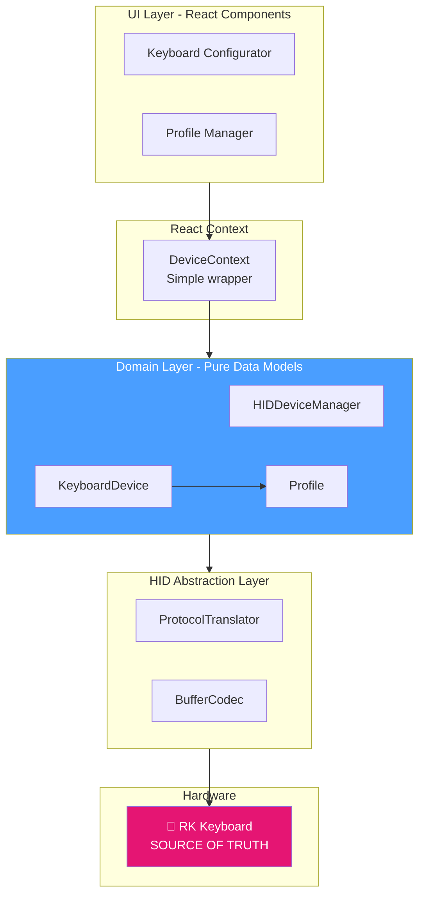
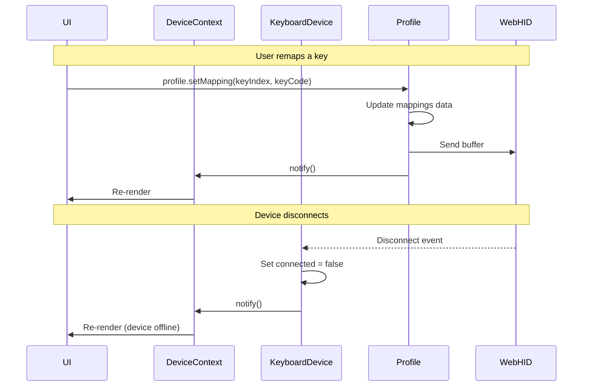

# RK-Web Design Document

## Overview

RK-Web is a web-based port of [Rangoli](https://github.com/rnayabed/rangoli) for Royal Kludge keyboard **key remapping only**. Uses WebHID API and React.

**Scope**: Key remapping with profiles. Lighting features will be added later.

## Technology Stack

### Frontend Framework
- **Vite** - Build tool and dev server (configured for GitHub Pages)
- **React 18+** - UI framework
- **TypeScript** - Type safety
- **TailwindCSS** - Styling

### Package Manager
- **Bun** - Fast package manager and runtime
- All commands use `bun` instead of `npm`

### Hardware Communication
- **WebHID API** - Direct HID device communication in Chrome/Edge browsers

### State Management
- **React Context** - Simple state distribution for device models
- **React hooks** - Built-in reactivity

### Storage
- **Keyboard hardware** - The only source of truth for active key mappings
- **localStorage** - Optional: UI theme preferences only
- **Note**: Profiles are JSON export/import via browser download/upload

### Deployment
- **GitHub Pages** - Static hosting
- **GitHub Actions** - CI/CD for automated builds

## Architecture

### High-Level Architecture



### Reactive Data Flow



## Core Components

### 1. HID Device Manager

Singleton responsible for device lifecycle management.

```typescript
class HIDDeviceManager {
  private static instance: HIDDeviceManager;
  private devices: Map<string, KeyboardDevice> = new Map();

  static getInstance(): HIDDeviceManager { /* ... */ }

  async requestDevice(): Promise<KeyboardDevice | null> { /* ... */ }
  async scanAuthorizedDevices(): Promise<KeyboardDevice[]> { /* ... */ }

  getDevice(id: string): KeyboardDevice | undefined { /* ... */ }
  getAllDevices(): KeyboardDevice[] { /* ... */ }
}
```

### 2. Profile Model

Manages key mappings with individual key updates.

```typescript
class Profile {
  name: string;
  mappings: Map<number, KeyCode> = new Map();

  async setMapping(keyIndex: number, keyCode: KeyCode): Promise<void>
  async clearMapping(keyIndex: number): Promise<void>
  getMapping(keyIndex: number): KeyCode | undefined
  hasMapping(keyIndex: number): boolean
  async clearAll(): Promise<void>
  toJSON(): object
}
```

### 3. Keyboard Device Model

Pure data model representing the keyboard.

```typescript
class KeyboardDevice {
  readonly id: string;
  readonly hidDevice: HIDDevice;
  readonly config: KeyboardConfig;
  connected: boolean = true;

  profiles: Profile[] = [];
  activeProfileIndex: number = -1;

  addProfile(name: string, initialMappings?: Map): Profile
  deleteProfile(index: number): void
  async activateProfile(index: number): Promise<void>
  getActiveProfile(): Profile | null

  exportSnapshot(name: string): string
  async importSnapshot(json: string): Promise<void>
}
```

### 4. React Context

Simple context to distribute devices to components.

```typescript
interface DeviceContextValue {
  devices: KeyboardDevice[];
  selectedDevice: KeyboardDevice | null;
  selectDevice: (device: KeyboardDevice | null) => void;
  requestDevice: () => Promise<void>;
}

export function useDevices(): DeviceContextValue
export function useSelectedDevice(): KeyboardDevice | null
```

## Data Models

```typescript
interface KeyboardConfig {
  pid: string;
  name: string;
  enabled: boolean;
  keyMapEnabled: boolean;
  top: [number, number];
  bottom: [number, number];
  keys: Key[];
}

interface Key {
  bufferIndex: number;
  keyCode: KeyCode;
  topX: number;
  topY: number;
  bottomX: number;
  bottomY: number;
}

enum KeyCode {
  Key_Escape = 0x29,
  Key_A = 0x04,
  // ... (from Rangoli's keycode.h)
}
```

## Usage Examples

### Remap Individual Key

```tsx
function KeyRemapper({ keyIndex }: { keyIndex: number }) {
  const profile = useSelectedDevice()?.getActiveProfile();

  if (!profile) return <div>Create a profile first</div>;

  return (
    <div>
      <KeyCodeSelector
        value={profile.getMapping(keyIndex)}
        onChange={(code) => profile.setMapping(keyIndex, code)}
      />

      {profile.hasMapping(keyIndex) && (
        <Button onClick={() => profile.clearMapping(keyIndex)}>
          Reset to Default
        </Button>
      )}
    </div>
  );
}
```

## Project Structure

```
rk-web/
├── design/                  # Design documentation
├── public/
│   └── keyboards/          # Keyboard configs from Rangoli
├── src/
│   ├── models/             # Domain models
│   │   ├── HIDDeviceManager.ts
│   │   ├── KeyboardDevice.ts
│   │   ├── Profile.ts
│   │   ├── ProtocolTranslator.ts
│   │   └── BufferCodec.ts
│   ├── context/
│   │   └── DeviceContext.tsx
│   ├── hooks/
│   │   └── useDevices.ts
│   ├── components/
│   │   ├── keyboard/
│   │   ├── profile/
│   │   └── keymap/
│   └── App.tsx
├── package.json
├── bun.lockb
└── vite.config.ts
```

## Bun Commands

```bash
# Install
bun install

# Dev server (with HTTPS for WebHID)
bun run dev

# Build
bun run build

# Preview
bun run preview
```

## WebHID Integration

**Browser Support**: Chrome 89+, Edge 89+, Opera 75+
**Requirements**: HTTPS (localhost works for dev)

```typescript
// Request device
const devices = await navigator.hid.requestDevice({
  filters: [{ vendorId: 0x258a }]
});

// Open and send
await device.open();
await device.sendReport(0, buffer);
```

## GitHub Pages Deployment

### vite.config.ts
```typescript
export default defineConfig({
  base: '/rk-web/',
  server: {
    https: true
  }
});
```

### Package.json
```json
{
  "scripts": {
    "dev": "bunx --bun vite --host",
    "build": "bunx --bun vite build"
  }
}
```

## Protocol

Key mapping uses 9 buffers (65 bytes each):
```typescript
[0]: 0x00  // Report ID
[1]: 0x0B  // Command: Key mapping
[2]: 0-8   // Buffer index
[3-64]: Key mapping data (from Rangoli)
```

## Future Enhancements

- Phase 2: Lighting support (RGB, modes, brightness)
- Phase 3: PWA, cloud sync, community profiles

## License

GPL v3 (same as Rangoli)

## Credits

Based on [Rangoli](https://github.com/rnayabed/rangoli) by Debayan Sutradhar.
